 

 

 

## 🌊 Overview

A full end-to-end **real-time IoT data migration pipeline** — built from scratch under a hard 5-hour hackathon deadline — that moves simulated on-premise IoT sensor data into the AWS Cloud, streams it through Kafka, captures changes via CDC, lands it in Snowflake, and visualizes it live on a public Streamlit dashboard.

> 5 simulated devices → MQTT over AWS IoT Core → Kafka (MSK) → Postgres (on-prem sim on EC2) → Debezium CDC → Kafka → Snowflake (Bronze/Silver/Gold via dbt) → Streamlit live dashboard.

 

## 🗺️ Live Architecture Flow

```mermaid
flowchart LR
    A(["📡 5 IoT Devices<br/>Python Simulator"]) -->|MQTT / SigV4| B["☁️ AWS IoT Core"]
    B -->|Rule Action| C[("Kafka MSK<br/>iot/geolocation")]
    C -->|Kafka Connect<br/>JDBC Sink| D[("🐘 PostgreSQL<br/>on EC2 (on-prem sim)")]
    D -->|WAL logical| E["🔄 Debezium CDC"]
    E -->|cdc.public.iot_events| F[("Kafka MSK<br/>iot-cluster-02")]
    F -->|Python Consumer| G[("❄️ Snowflake<br/>RAW.IOT_EVENTS")]
    G --> H["🧱 dbt<br/>Bronze → Silver → Gold"]
    G --> I["📊 Streamlit Dashboard<br/>Live on EC2:8501"]

    style A fill:#0F2027,stroke:#00E0FF,color:#fff
    style B fill:#FF9900,stroke:#232F3E,color:#000
    style C fill:#231F20,stroke:#00E0FF,color:#fff
    style D fill:#4169E1,stroke:#fff,color:#fff
    style E fill:#c62828,stroke:#fff,color:#fff
    style F fill:#231F20,stroke:#00E0FF,color:#fff
    style G fill:#29B5E8,stroke:#000,color:#000
    style H fill:#FF694B,stroke:#fff,color:#fff
    style I fill:#FF4B4B,stroke:#fff,color:#fff
```

 

## 🚀 Phases

<table>
<tr>
<td width="50%" valign="top">

### Phase 1 — Ingestion & On-Prem Sim
- 5 simulated devices publish `device_id`, `lat/long`, `timestamp` every 5s
- MQTT via websockets + AWS SigV4 signing
- Routed through **AWS IoT Core → Kafka MSK**
- **Kafka Connect JDBC Sink** → PostgreSQL on EC2 (`iot_events`)
- S3 backup of raw stream

</td>
<td width="50%" valign="top">

### Phase 2 — CDC & Analytics
- Postgres `wal_level = logical` enabled
- **Debezium PostgreSQL Connector** captures changes
- Change events flow to `cdc.public.iot_events` topic
- Python consumer streams into **Snowflake RAW**
- **dbt** models: Bronze → Silver → Gold
- **Streamlit** dashboard for live visualization

</td>
</tr>
</table>

## 🧰 Tech Stack

| Layer | Service |
|---|---|
| Ingestion | AWS IoT Core, MQTT (SigV4) |
| Streaming | Amazon MSK (Kafka), Kafka Connect |
| On-Prem Simulation | PostgreSQL on EC2 |
| CDC | Debezium |
| Warehouse | Snowflake |
| Transformation | dbt |
| Visualization | Streamlit |
| Compute | Amazon EC2 |

 

## ⚡ Key Engineering Decisions

- 🚫 **No Lambda** — kept the pipeline native to MSK + IoT Core by design
- 🔁 Switched **MSK Serverless → MSK Provisioned** after discovering IoT Core's native Kafka rule action doesn't support IAM auth on Serverless
- 🔐 SASL/SCRAM auth via Secrets Manager + customer-managed KMS key
- 🐍 Built a lightweight Python Kafka→Snowflake consumer as a pragmatic swap for the official Snowflake Kafka connector, under time pressure
- 🎯 Prioritized a **working, demoable end-to-end pipeline** over a fully polished Gold layer — a deliberate scope call given the 5-hour limit

 

**Built by Abdul Rehman Sani (Hu)** · SMIT Cloud Data Engineering

